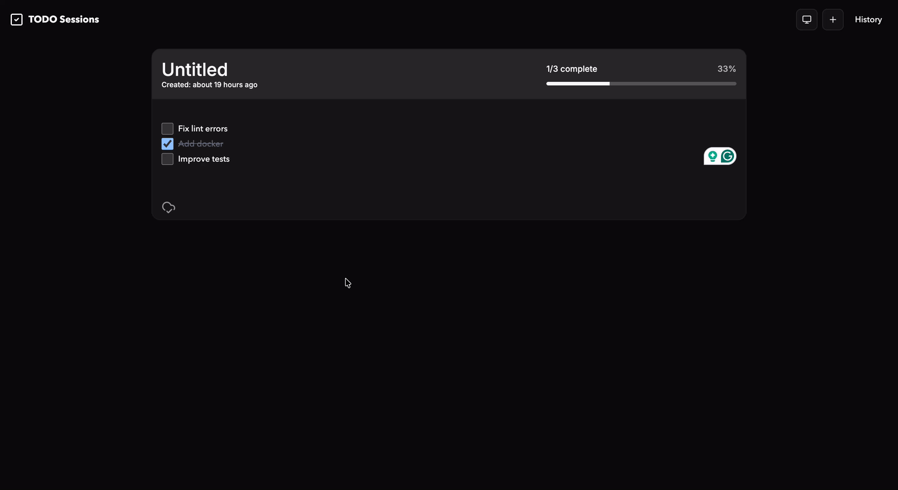
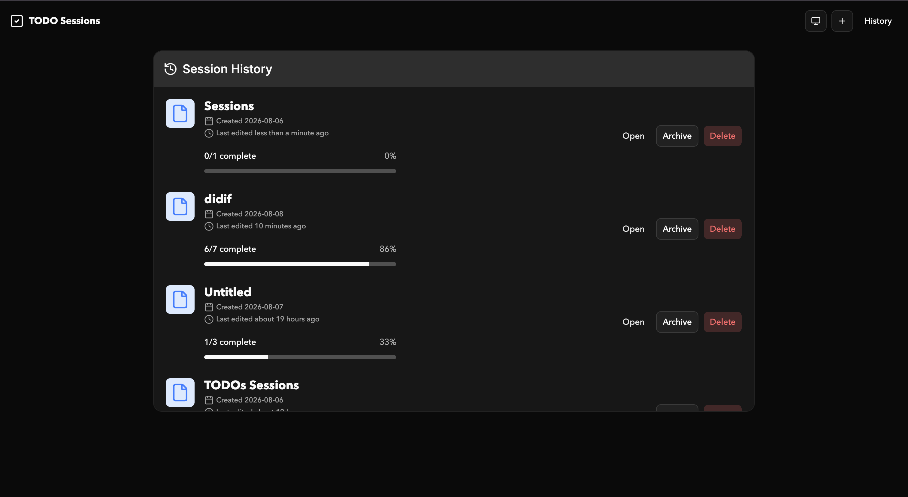

# Sessions

Sessions is a concentrated to-do list app built with an **offline-first**, **reliable**, and **noiseless** approach in mind.

I built it because I wanted a simple way to manage my to-dos without too much stress. No complicated productivity system, no endless configuration — just a place to write down what needs to get done and focus on it.

## Demo




## Features

- **Sessions** — Group your to-dos into focused sessions.
- **Offline-first** — Your sessions are stored locally, so the app works without an internet connection.
- **Session history** — Keep track of previous sessions and revisit them when needed.
- **Simple task management** — Add, edit, reorder, complete, and remove tasks without unnecessary complexity.
- **Themes** — Light, dark, and system themes.
- **PWA** — Install Sessions and use it like a native application.

## Why Sessions?

I don't think a to-do list needs to be a productivity system.

Sometimes you just need somewhere to put the things you need to do, without having to think about priorities, labels, projects, reminders, deadlines, and a dozen other things before you can get started.

Sessions is built around that idea.

**Write it down. Work through it. Move on.**

## Getting Started

You'll need [Node.js](https://nodejs.org/) and [pnpm](https://pnpm.io/).

```bash
git clone https://github.com/EArnold1/todo-sessions.git
cd todo-sessions
pnpm install
pnpm dev
```

## Run with Docker

The published image is self-contained: it builds and serves the web app on port
`9200`.

```bash
docker run --rm -p 9200:9200 arnolddd/sessions:latest
```

Open [http://localhost:9200](http://localhost:9200). Sessions are stored in the
visitor's browser (IndexedDB), so there is no server database to configure and
data is not shared between browsers or devices.

### Build locally

```bash
docker build -t sessions:local .
docker run --rm -p 9200:9200 sessions:local
```

## Future Plans

Sessions is intentionally small, but there are a few things I'd like to explore as it grows.

### BYOS (Bring Your Own Server)

A planned feature is **BYOS (Bring Your Own Server)**.

The goal is to allow users to connect Sessions to a server they control and use it to sync their sessions and to-dos across devices.

Sessions will remain **offline-first**, with the server acting as an optional way to keep your data in sync rather than making it a requirement for the app to work.

## Philosophy

Sessions will continue to prioritize:

- **Focus over features**
- **Simplicity over complexity**
- **Reliability over dependency**
- **Less noise over more functionality**

If a feature doesn't make managing your to-dos simpler, it probably doesn't belong here.

## Contributing

If you have an idea, bug report, or improvement, feel free to open an issue or submit a pull request.

Before contributing, please keep the project's core philosophy in mind:

> Does this make managing tasks simpler, or does it give the user another thing to manage?
